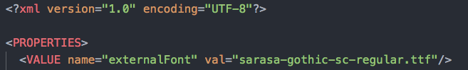
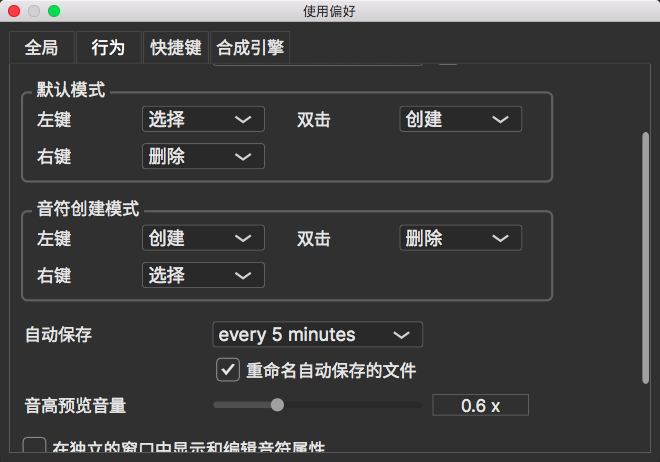
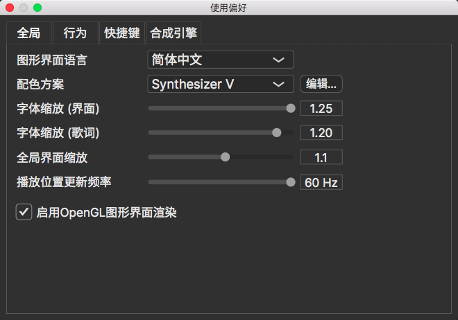

# Synthesizer V 中文用户手册 

**此项目已过时。欲了解新版资料，请参考官方配套资源**

[Synthesizer V Studio Tutorial Series]: https://www.youtube.com/watch?v=5f50-Ircdvs&amp;list=PLmYtpIFKN5iKaUlB6mRGzFJ0SGRJgRIPz

[Synthesizer V Studio 快速使用教程]: https://www.bilibili.com/video/BV1yL4y1J7E2

[Synthesizer V Studio Scripting Manual]: https://resource.dreamtonics.com/scripting/

> 此项目的目标是将 [Synthesizer V 官方用户手册](https://synthesizerv.com/manual/#) 中的内容翻译成中文。水平有限，若有出入，请以原文为准。

文档页面链接：[https://sv.miix.cc/](https://sv.miix.cc/)

GitHub项目链接：[https://github.com/miixcc/synthesizerv-user-manual-zh-cn/](https://github.com/miixcc/synthesizerv-user-manual-zh-cn/)

[Synthesizer V 官方网站](https://synthesizerv.com/)

[Synthesizer V 官方论坛](https://forum.synthesizerv.com/)

## 在开始使用前

1. **更换字体**

Windows和Linux版本的Synthesizer V自带的是日版字体，在显示某些汉字时的字形可能看起来会比较奇怪。
建议更换为其他字体。这里提供开源的 [Sarasa Gothic](https://github.com/be5invis/Sarasa-Gothic) ：[点此下载](https://raw.githubusercontent.com/miixcc/synthesizerv-user-manual-zh-cn/master/docs/zh-cn/tips/sarasa-ui-sc-regular.ttf)

将字体文件放入安装目录，把 *settings.xml* 中的 *NotoSansCJKjp-Regular.otf* 改为 *sarasa-ui-sc-regular.ttf* ，保存即可。

2. **自动保存**

`设置` - `使用偏好` - `行为` - `自动保存`

3. **界面调整**
   
   `设置` - `使用偏好` - `全局` - `启用OpenGL渲染`

    `字体缩放`可以调整字体大小。
    
    `全局界面缩放`可以调整界面元素大小，但最好不要改得太大(~~很有可能改不回来~~)

    `播放位置更新频率` 调到最大，可以让扫描线顺滑一些。

