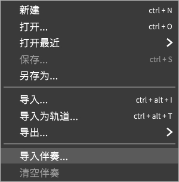

# 加入伴奏

每个项目都有一个伴奏轨用于快速预览最终效果。

但由于SynthV的关注的是人声部分的制作，所以在**渲染到文件**的时候**不会**包含伴奏。

你应该使用DAW(Digital Audio Workstation / 数字音频工作站)软件来把伴奏与人声混合。

要导入伴奏到工程中，请使用 **文件** 中的 **导入伴奏...** 。

SynthV支持大多数主流的音频格式。支持格式的准确列表与安装在操作系统上的编解码器有关。

注意：不建议使用<u>.mp3</u>文件，因为有些文件不支持精确查找，而且在使用声乐时可能会导致同步问题。建议在使用之前将它们转换为<u>.wav</u>文件。

然后，在 **视图** 中 **添加伴奏面板** 。默认添加的伴奏面板将停靠在顶部。

### 混音面板

点击右上角的耳机图标打开混音面板来控制人声和乐器音量。