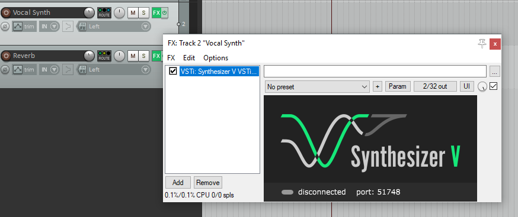
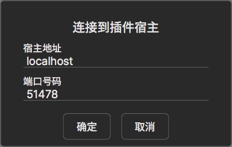
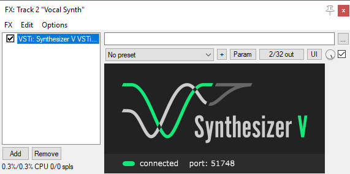
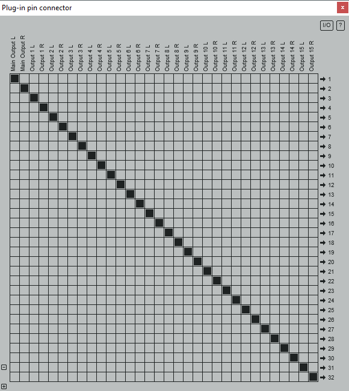
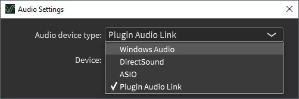

# 连接DAW

你可以通过VSTi插件将编辑器连接到DAW软件。此处用REAPER演示。

配置插件搜索路径后，在一条轨道上加载Synthesizer V VSTi。

`设置` - `连接到插件宿主`

输入插件上显示的端口号，然后按“确定”。

这个功能也可以连接到局域网内运行在*另一台*电脑上的DAW。

插件会显示`已连接`。

音频将从编辑器传输到DAW中。
DAW还将接管编辑器的传输和回放，尽管反向控制（编辑器控制DAW的传输和回放）可能只能用于REAPER（要归功于REAPER的VST API扩展）

插件有16个立体声输出通道。第一个通道是混音，其余的对应于打开工程中的轨道。

按`设置` - `断开宿主连接`来结束连接。

断开连接后将出现音频设置，把音频设备类型改回来。

