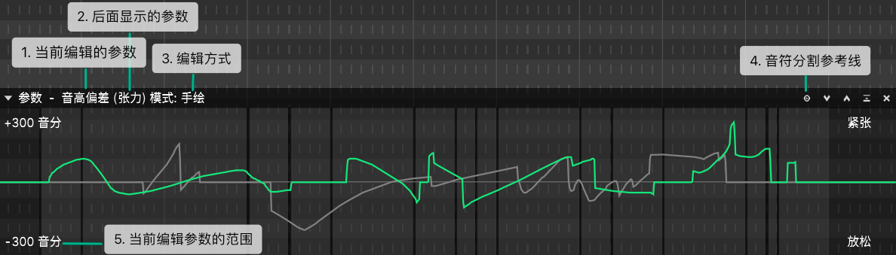

# 编辑参数

可以一边编辑一个参数时后面显示另一个以供参考。

1. **当前编辑的参数**

点击切换

|   参数   |                              描述                              |
| :------: | :------------------------------------------------------------: |
| 音高偏差 | 添加到基准音高线的一层偏移。对于音高的总体控制，请使用`音符属性` |
| 颤音包络 |                          颤音振幅调整                          |
|   响度   |                            音量大小                            |
|   张力   |                         声音加强/放松                          |
|   气声   |                            气流大小                            |
|   发声   |                   正常发音和低语之间的插值。                   |
|   性别   |                           共振峰移动                           |

2. **后面显示的参数**

3. **编辑方式**

    |      方式      |                    描述                    |
    | :------------: | :----------------------------------------: |
    |      手绘      |         左键拖动绘制，右键拖动擦除         |
    | 手绘（重叠式） | 直接在钢琴卷帘上面画。只能用于`音高偏差  ` |
    |      直线      |       左键拖动绘制直线，右键拖动擦除       |
    |     橡皮擦     |                左键拖动擦除                |

4. **音符分割参考**
   
点击打开/关闭。

打开后，背景会显示音符边界。

5. **当前编辑的参数范围**

对于 `音高偏差`，单击在 *+-300音分* 、 *+-600音分* 和 *+-1200音分* 之间切换。