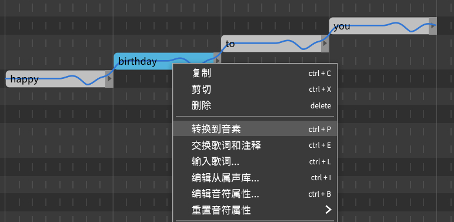
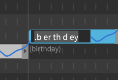
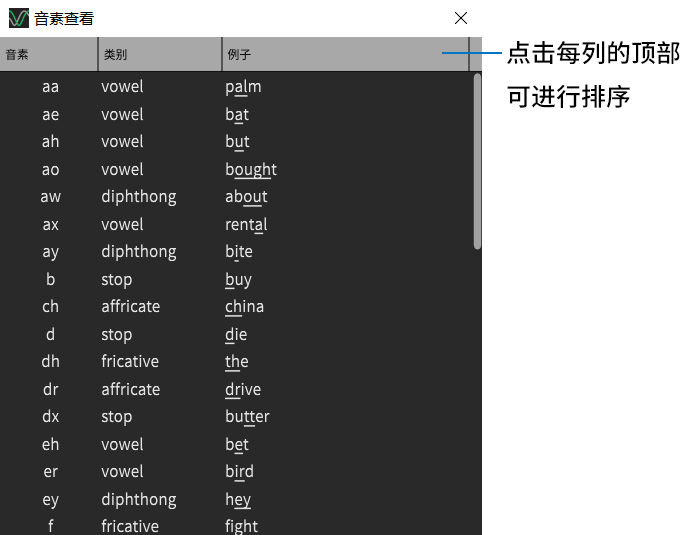
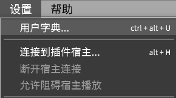
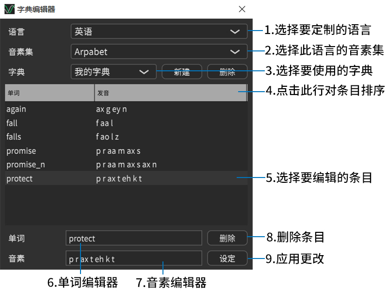

# 编辑音素

右键单击一个音符，选择`转换到音素`，或者使用相应的快捷键将歌词替换为音标。

你还可以在`音符`菜单中找到类似的命令。

这个操作不会改变音符的发音，但是给你在**音素**级别修改发音的自由。

**注意**：在使用`转换到音素`命令之前，必须先加载一个音轨。

每种语言的音素都不同。若需更多信息，请参阅[查看音素](/zh-cn/intermediate-and-advanced-usage/editing-phonemes.md?id=音素查看)。

你将看到原始歌词被移动到音符的下方。当尝试编辑转换后的歌词时，音素前面有一个点标记。点标记表示音符使用基于音素的歌词，而不是单词。
使用`交换歌词和注释`来还原原来的歌词。

**技巧**：编辑歌词时按`Ctrl`+`P`(或自定义的快捷键)进行音素转换。

## 查看音素

`查看音素`列出当前加载的语言可用的音素，并在音素级歌词编辑时作为参考。

每种语言都有自己的音素和符号。

| 语言           | 适合歌唱的表示法      |   语音学表示法          |
|  :--------:    |  :--------:            |  :--------:        |
| English      |  单词                  |  Modified Arpabet     |
| 汉语(普通话)  | 汉字(简体/繁体)，拼音   |   X-SAMPA |
| 日本语        |  平假名，片假名，罗马音 | Romaji-derived symbols |

## 用户字典

你可以通过创建`用户字典`自定义单词到音素的转换。

从`设置`菜单启动`字典编辑器`。

每种语言/音素组合只能激活一本字典。在回放过程中，合成引擎将首先在用户字典中查找项目，如果没有包含该项，将使用默认的单词到音素转换器。

2. **选择语言音素集**

    在当前版本中，每种语言都与一个音素集相关联。

3. **选用要使用的字典**

    所选字典将成为所选语言和音素组合的默认字典。

    如果没有字典，则需要`新建`一个来继续。

6. **单词编辑器**

    所选条目的单词将出现在这里。

    您还可以键入目前不在字典中的单词，然后按`设定`创建新条目。

7. **音素编辑器**

    编辑单词时，一个由机器建议的发音将出现在这里。

    如果要纠正它，请编辑此文本框的内容。

9. **应用更改**

    如果单词已经在列表中，则更新相应的条目。
    
    否则单词/音素会被添加到列表中。