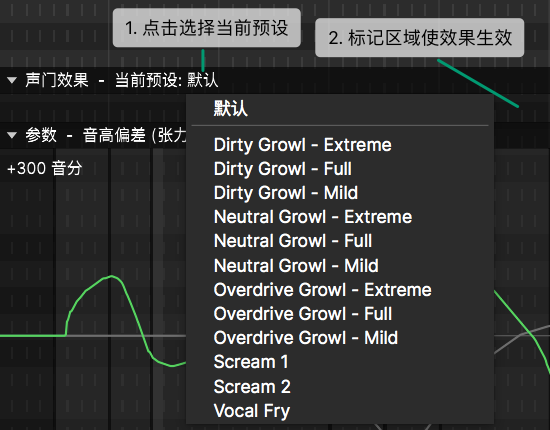
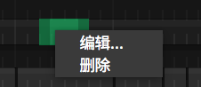
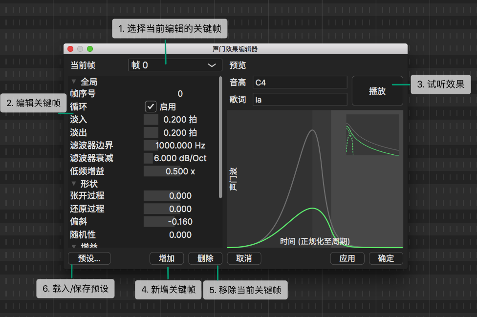

# 声门效果

从`视图菜单` 创建 `声门效果` 面板并标记区域来应用所需效果，为声音添加失真。

2. **标记区域使效果生效**

选定预设后，在 `声门效果` 面板的空白区域中拖动以应用。

标记的区域将显示为高亮。右键单击可对其进行[编辑](#%e5%a3%b0%e9%97%a8%e6%95%88%e6%9e%9c%e7%bc%96%e8%be%91%e5%99%a8)或删除。

双击高亮区域将启动 `声门效果编辑器`。

## 声门效果编辑器

声门效果编辑器是用于创建完全自定义效果预设的高级工具。
它可以在微观层面上直接控制波形。

要了解这一特点，首先要注意的是，声音是通过（近似地）用一个窄的、形状可变的管道（声道）过滤声门发出的声音而产生的。在声门处，发声时声带每秒打开和关闭几百次。如果模式是规则和连续的，可以听到一定的音调。然而，不规则的模式可能会产生扭曲的声音或咆哮和气泡音。

在许多情况下，声带的振荡是由其他一些器官或组织调节的，因此可以观察到由几个基本周期组成的宏观模式/周期（通常小于10个，因此不到50毫秒就可以给人留下印象）。引擎能够在一定程度上模拟这种现象，而声门效应编辑器的主要用途是模拟这种宏模式，尽管它可能被“滥用”来创建颤音和其他效果。

把每一个宏模式看作是由一些静止图像制成的动态图像。首先，我们定义两个或三个具有最显著特征的图像（关键帧），然后引擎将在这些关键帧之间进行插值以创建中间状态，并且通过同步帧的切换和音调，插值模式可以每秒循环20-80次。

1. **选择当前编辑的关键帧**

注意：当`循环` 处于启用状态时，不会播放最后一个关键帧（而是跳回第0帧）。

2. **编辑关键帧**

|      选项       |                                           描述                                            |
| :-------------: | :---------------------------------------------------------------------------------------: |
|     帧序号      |              当前关键帧在宏模式中的位置。最后一个关键帧的索引是宏模式的长度               |
|      循环       |                                    宏模式是否应该循环                                     |
|      淡入       |                                    淡入效果的持续时间                                     |
|      淡出       |                                    淡出效果的持续时间                                     |
| 滤波器边界/衰减 | 一组低通/高通滤波器用于混合未经修改的声音和失真的声音。在截止频率以下，保留未经修改的声音 |
|    低频增益     |                              应用于低于截止频率的语音的增益                               |
|    张开过程     |                               在当前关键帧中打开声带的速度                                |
|    还原过程     |                                当前关键帧中的声带返回速度                                 |
|      偏斜       |                           当前关键帧中低频和高频内容之间的平衡                            |
|      增益       |                                    当前关键帧处的振幅                                     |
|    时间偏移     |                                  当前关键帧处的时间偏移                                   |
|     随机性      |                                   控制参数中添加的噪声                                    |

4. **新增关键帧**

它会新建一个和当前关键帧一样的关键帧。