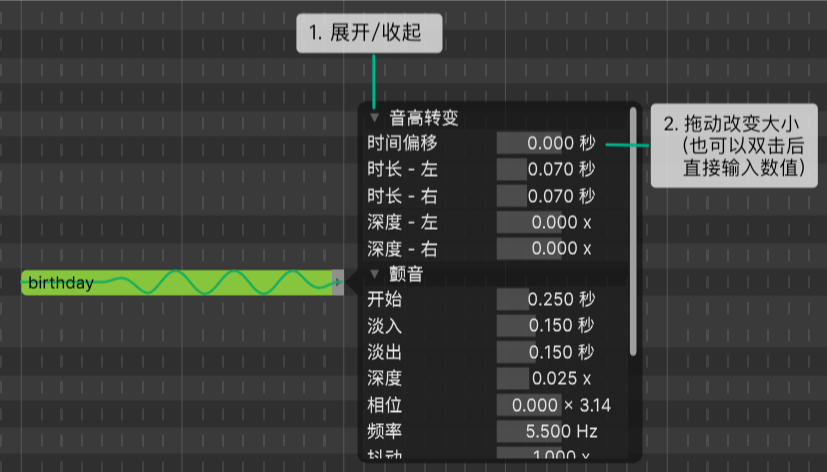
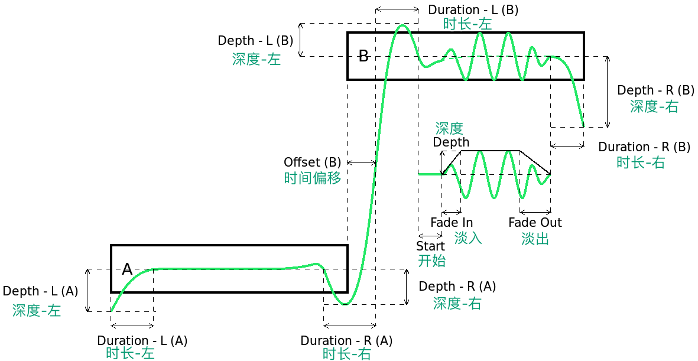

# 音符属性

右键单击一个音符，然后`编辑音符属性...`(或按`Ctrl`+`B`)打开`音符属性`面板。

音符属性面板提供了对音高和音素时长的基本控制。

## 音高转换和颤音

`音符属性`面板中的音高转变和颤音设置是为了建立一个大概的音高轮廓。详细调整请通过`参数面板`进行。

`音高转变`控制着音符边界附近的音高曲线。`颤音`则适用于音符的中间部分。下图解释了这些属性：

其中A代表该属性为A音符的，B同理。

### 其他颤音特性

1. **相位**
   
   类正弦波振动开始时的相位（相对于完整的周期）。

2. **频率**

   每秒振动频率。

3. **抖动**
   
   在音高曲线上加入的自然起伏的多少。

## 音符时间

音符时间属性允许您调整一个整音中的音素的时间分布。

假设每个音符对应一个音节：

1. **音节偏移**
   
推迟或提前音节开始的时间。

2. **音节首**
   
调整前导辅音的持续时间。

3. **音节尾**
   
调整尾随辅音的持续时间。

4. **音节腹部**
   
扭曲音节腹部。当音节包含双元音时很有用，如`ay`。
