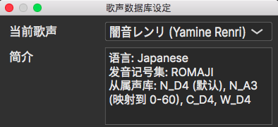
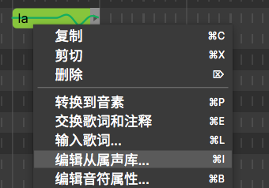
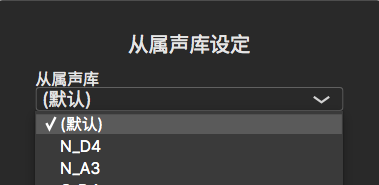
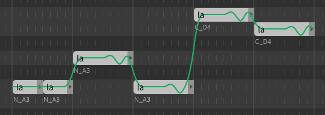

# 从属声库

有的声库包含在不同语音寄存器上记录的同一组样本。每一组样本都被称为一个从属声库。软件通过音符的音调与最合适的从属声库匹配。

映射规则可以在[歌声数据库设定](/zh-cn/quickstart-guide/singer-selection.md)窗口中找到，例如：

可以通过为每个音符指定从属声库来覆盖默认映射。

右键单击所选内容，`编辑从属声库...`。

每个音符的从属声库将显示在它下面。

