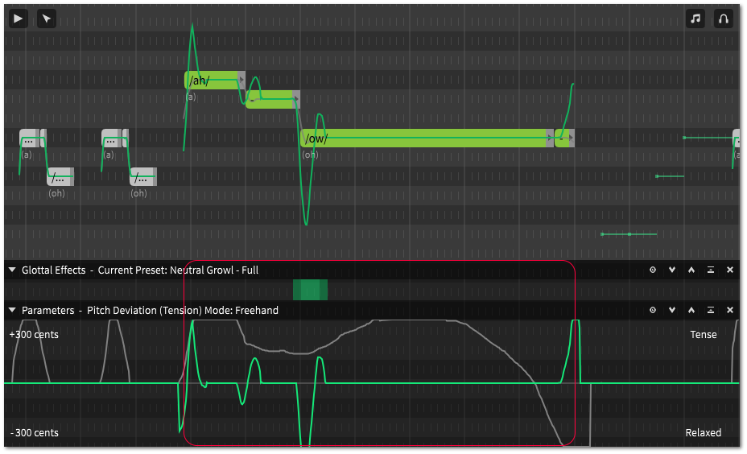
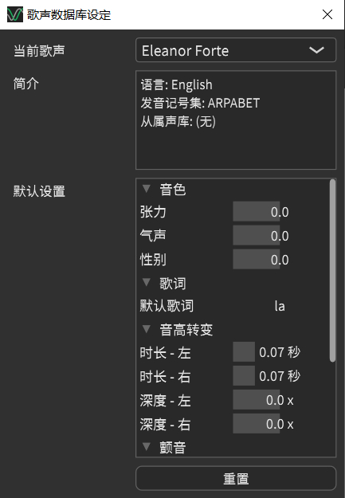
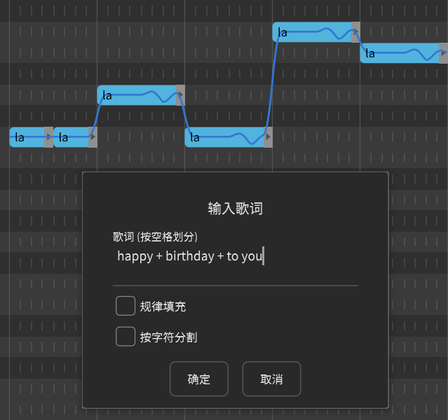
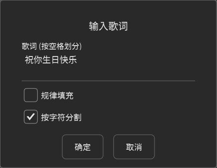
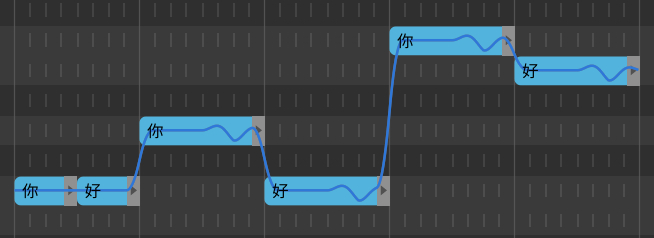
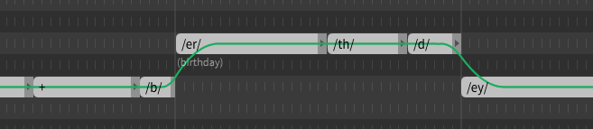

# 一些技巧和杂七杂八

## 参数同步模式

在 **参数同步模式** 下，对音符的编辑、复制和删除对与所选内容重叠的参数同样生效。

打开/关闭参数同步模式的开关可以在 `编辑` 菜单中找到。

例如：将选择的部分拖到不同的位置，红色框中的参数和声门效果也会一起跟着移动。

这些更改适用 **所有** 参数(而不只是当前编辑/显示中的参数)。

## 默认音符属性

可以在 `歌声数据库设定` 窗口中为每条音轨设置音符属性和参数的默认值。

对于 **音色** ，默认值会与当前参数叠加。

对于 **歌词** ，默认的歌词只会作用于在这之后创建的音符。

对于 **音高转变** 和 **颤音** ，默认值会作用于所有未手动指定对应属性的音符。

## 批量输入歌词

选择一组音符并使用 `音符` 菜单或右键单击菜单中的 `输入歌词…` 来填写歌词。

空格会被识别为音符分隔符。

由于中文和日文不按空格分隔单词，请勾选 **按字符分割** 。

若要为一大组音符填写相同的歌词，请勾选 **规律填充** ，文本框中的单词将被重复。例如：

## 子音节音符

一个更高级的用法是将音符分解成比音节小的元素或者说独立音素来实现对音程的精确控制。

编辑之前，[吸附部分](/zh-cn/quickstart-guide/editing-notes.md)应被设置为一个相当小的级别(如1/32)。

“happy birthday”的例子可以分解为:

实际上很少需要这种操作，因为在没有辅音群的情况下，使用内置的音符时间属性可以达到相同的效果。