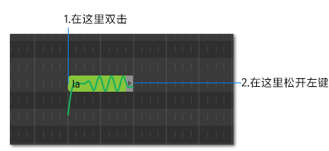
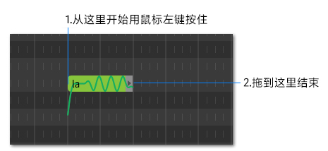

# 创建音符

SynthV提供了在音符区输入音符的两种方式:`默认模式`和`创建音符模式`。

点击左上角的按钮在两种模式之间切换。

### 默认模式

在音符编辑区中**双击** (第二次单击后不要释放鼠标左键)并拖动鼠标可以创建你所需要长度的音符。

在此模式下可以通过拖动鼠标来一次框选多个音符。

### 创建音符模式

在音符编辑区中的任意位置拖动鼠标可以创建你所需要长度的音符。

