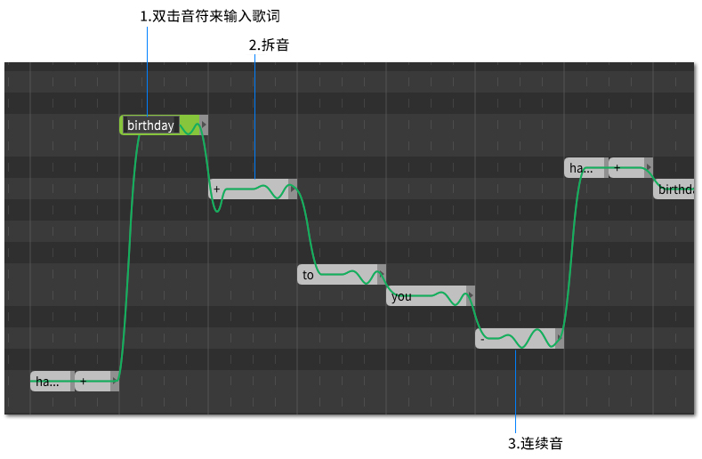

# 输入歌词

1. **双击音符来输入歌词**

按下`Enter`确认更改，按下`Esc`放弃更改。按下`Tab`确认更改并进入下一个音符中，按下`Ctrl`+`Tab`确认更改并回到上一个音符。

如果文本框太小导致无法显示歌词，请放大(`Ctrl` + `鼠标滚轮`)。

2. **拆音**

使用`+`来分解多音节单词。在这个例子中，第一个音符是 **birth**，第二个音符是 **day**。

3. **连续音**

用减号延续最后一个元音。