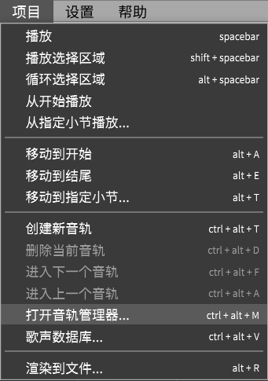

# 管理音轨
从`项目`菜单中打开`音轨管理器`。

你可以使用`音轨管理器`添加/删除音轨和编辑音轨属性。

11. **打开/关闭合成引擎**

关闭合成引擎也会使音轨无声化。
这样可以减少回放期间(在其他音轨上)的CPU消耗，以期待更低的延迟。

15. **为此音轨编辑声库设定**

单击此处将打开 [歌声数据库设定](/zh-cn/quickstart-guide/singer-selection.md) 窗口。