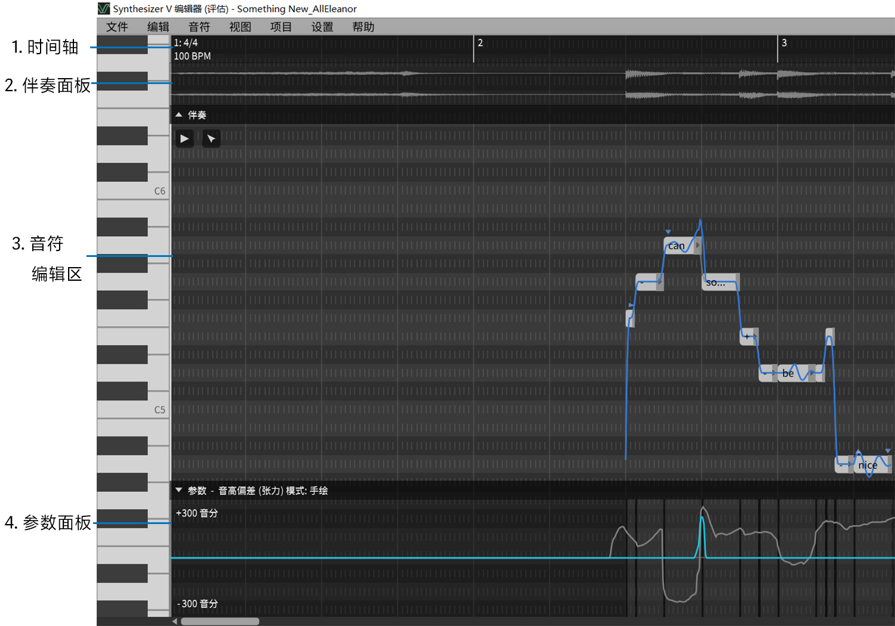

# 工作区

下图展示的是一个典型的多音轨项目工作区(带一个伴奏音轨)。

1. **时间轴**

    显示拍号。

2. **伴奏面板**

    显示伴奏的波形。

3. **音符编辑区**

    在这里创建和编辑音符。这里也会同时会显示其他音轨的音符。

4. **参数面板**

    这里可以编辑和查看参数。

**在音符区域中导航**

除了使用底部和右侧边框上的滚动条外, 还可以使用`鼠标滚轮 + 组合键`方便地向各个方向导航。

|       快捷键       |         作用         |
| :----------------: | :------------------: |
|      鼠标滚轮      |       上下移动       |
| 鼠标滚轮 + `Shift` |       左右移动       |
| 鼠标滚轮 + `Ctrl`  | 往鼠标光标处水平缩放 |