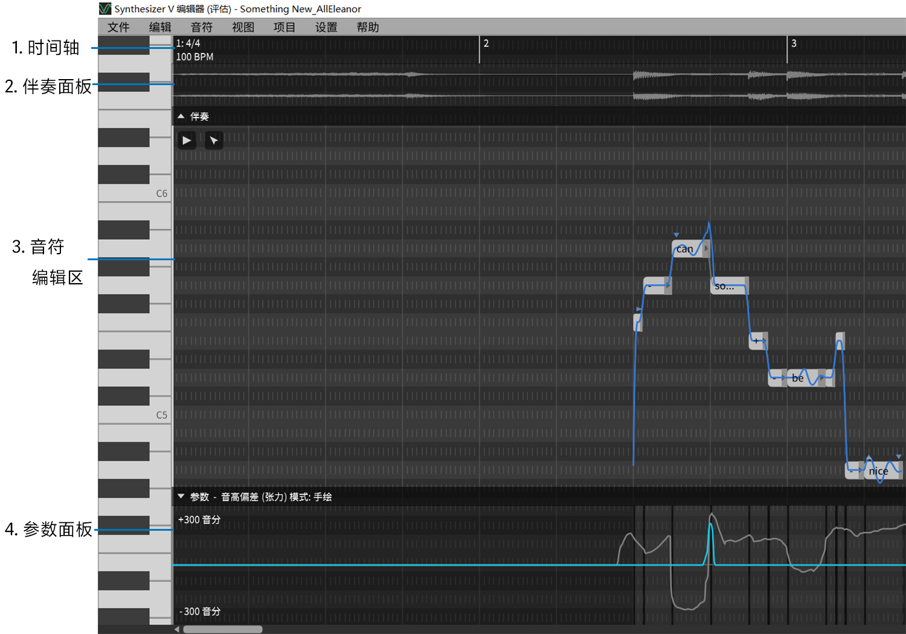

# 工作区

下图展示的是一个典型的多轨项目工作区(有一个伴奏轨)。

1. **时间轴**

    显示拍子记号。

2. **伴奏面板**

    显示与乐谱同步的伴奏音轨(如果有的话)的波形。

3. **音符编辑区**

    在这里创建和编辑音符，同时显示其他音轨的音符以供参考。

4. **参数面板**

    这里可以编辑和查看参数。

### 在音符区域中导航

除了使用底部和右侧边框上的滚动条外, 还可以使用`鼠标滚轮 + 组合键`方便地向各个方向导航。

| 快捷键               |  作用        |
|  --------            |  --------    |
| 鼠标滚轮             |  上下移动    |
| 鼠标滚轮 + `Shift`   |  水平移动    |
| 鼠标滚轮 + `Ctrl`    |  往鼠标指针处水平缩放      |